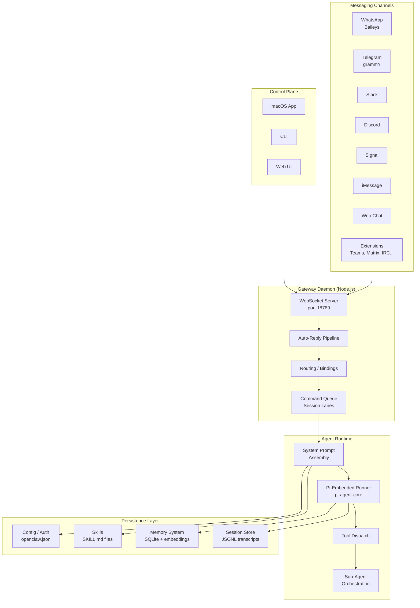

# OpenClaw Architecture Overview

## What Is OpenClaw?

OpenClaw is an open-source, multi-channel AI agent platform that acts as a personal assistant gateway. It connects one or more AI "brains" (agents) to multiple messaging surfaces through a single long-lived daemon process.

## Core Architecture



## Component Summary

| Component | Responsibility | Key Files |
|-----------|---------------|-----------|
| **Gateway Daemon** | Owns all messaging provider connections; exposes typed WebSocket API | `src/gateway/` |
| **Auto-Reply Pipeline** | Inbound message processing: command detection, debouncing, group activation | `src/auto-reply/` |
| **Agent Runtime** | LLM inference loop with tool execution, streaming, compaction | `src/agents/pi-embedded-runner/` |
| **Session Manager** | Per-agent chat history as JSONL transcripts | `src/config/sessions.ts` |
| **Tool System** | 25+ built-in tools plus plugin-provided tools, policy-gated | `src/agents/tools/` |
| **Sub-Agent System** | Hierarchical spawning, steering, and lifecycle management | `src/agents/subagent-*.ts` |
| **Skills System** | Loadable instruction bundles (SKILL.md) discovered from workspace/bundled/plugins | `src/agents/skills/` |
| **Memory System** | Vector-indexed persistent memory with hybrid search | `src/memory/` |
| **Cron/Hooks** | Scheduled tasks, event-driven automation, Gmail watch | `src/cron/`, `src/hooks/` |
| **Browser/Canvas** | Playwright/CDP browser automation and A2UI canvas rendering | `src/browser/`, `src/canvas-host/` |
| **Sandbox** | Docker-based execution isolation with configurable access levels | `src/agents/sandbox.ts` |

## Key Design Principles

1. **Single gateway, many channels** - One daemon process owns all provider connections.
2. **Per-session serialization** - Runs are queued per session key to prevent transcript races.
3. **Push-based sub-agents** - Sub-agents announce results when done; no polling needed.
4. **Lazy skill loading** - Skills are discovered at startup but only read on demand.
5. **Agent isolation** - Each agent has its own workspace, auth profiles, sessions, and persona.
6. **Policy-gated tools** - Every tool call passes through configurable allow/deny policies.
7. **Auto-compaction** - Context overflow triggers automatic summarization and retry.

## Repository Structure

```
openclaw/
  src/
    agents/             # Agent runtime, tools, skills, sub-agents, system prompt
    auto-reply/         # Inbound message pipeline
    gateway/            # WebSocket gateway server
    browser/            # Playwright/CDP browser control
    canvas-host/        # A2UI canvas hosting
    cron/               # Cron scheduling service
    hooks/              # Event-driven automation hooks
    memory/             # Vector-indexed memory system
    channels/           # Channel abstractions
    config/             # Configuration loading and validation
    cli/                # CLI command wiring
    telegram/           # Telegram adapter (grammY)
    discord/            # Discord adapter
    slack/              # Slack adapter
    signal/             # Signal adapter
    imessage/           # iMessage adapter
    whatsapp/           # WhatsApp adapter
    web/                # Web chat adapter
    plugins/            # Plugin system
    routing/            # Message routing and session keys
    shared/             # Shared utilities
  extensions/           # 36 extension packages (channels, tools, skills)
  skills/               # 50+ bundled skills
  docs/                 # Documentation (Mintlify)
  vendor/               # Vendored dependencies (A2UI)
  apps/                 # Native apps (iOS, Android, macOS)
```
