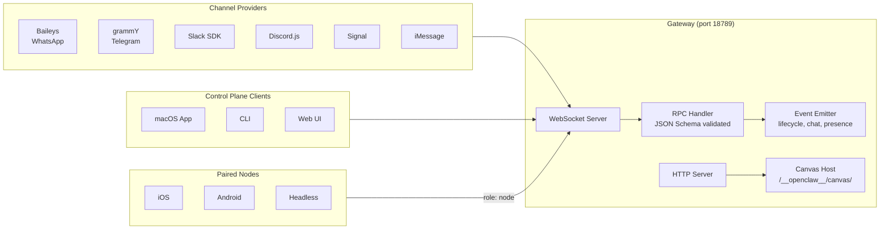
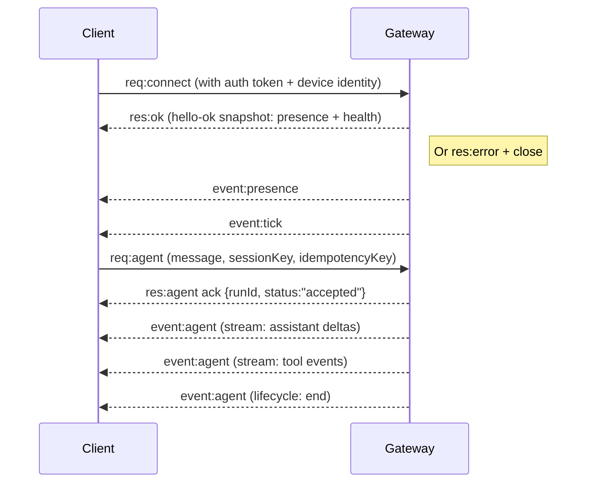

# Gateway Architecture

## Overview

The Gateway is a single long-lived Node.js daemon that owns all messaging surface connections and exposes a typed WebSocket API for control-plane clients.

**Source:** `src/gateway/`, `docs/concepts/architecture.md`

## Components

## WebSocket Protocol

- **Transport:** WebSocket, text frames with JSON payloads
- **Handshake:** First frame **must** be `connect`; non-JSON or non-connect first frame triggers hard close
- **Authentication:** If `OPENCLAW_GATEWAY_TOKEN` is set, `connect.params.auth.token` must match

### Wire Format

| Direction | Format |
|-----------|--------|
| Request | `{type:"req", id, method, params}` |
| Response | `{type:"res", id, ok, payload\|error}` |
| Event | `{type:"event", event, payload, seq?, stateVersion?}` |

### Key RPC Methods

| Method | Purpose |
|--------|---------|
| `connect` | Initial handshake (required first frame) |
| `health` | Health check |
| `status` | System status |
| `agent` | Trigger agent run (returns `{runId, acceptedAt}` immediately) |
| `agent.wait` | Wait for agent run completion (default 30s timeout) |
| `send` | Send a message through a channel |
| `sessions.patch` | Update session metadata |

### Event Streams

The gateway emits an `agent` event that wraps different stream types:

| Stream Type | Payload |
|-------------|---------|
| `lifecycle` | `phase: "start" \| "end" \| "error"` |
| `assistant` | Streamed text/reasoning deltas |
| `tool` | Tool `phase: "start" \| "update" \| "result"` events |
| `compaction` | `phase: "start" \| "end"` |

Additional top-level events:

| Event | Payload |
|-------|---------|
| `presence` | Provider connection status |
| `tick` | Periodic heartbeat |
| `chat` | Chat message deltas and finals |
| `heartbeat` | Heartbeat events |
| `shutdown` | Gateway shutting down |

> **Note:** The wire protocol uses `PROTOCOL_VERSION = 3`. The `connect` frame includes `minProtocol`/`maxProtocol` fields for version negotiation.

## Connection Lifecycle

## Pairing and Trust

- All WS clients include a **device identity** on connect
- New device IDs require pairing approval
- Gateway issues a **device token** for subsequent connects
- Local connects (loopback) can be auto-approved
- Non-local connects must sign the `connect.challenge` nonce

**Source:** `src/gateway/`, `docs/concepts/architecture.md`, `docs/gateway/protocol`

## Nodes

Nodes are macOS/iOS/Android/headless devices that connect with `role: node`:

- Provide device identity in `connect`
- Expose commands: `canvas.*`, `camera.*`, `screen.record`, `location.get`
- Pairing is device-based with approval in the device pairing store

**Source:** `src/agents/tools/nodes-tool.ts`, `docs/nodes/`

## Canvas Host

The canvas is served by the gateway HTTP server:

- `/__openclaw__/canvas/` - Agent-editable HTML/CSS/JS
- `/__openclaw__/a2ui/` - A2UI host for structured UI generation
- Same port as the gateway (default 18789)

**Source:** `src/canvas-host/`, `vendor/a2ui/`
