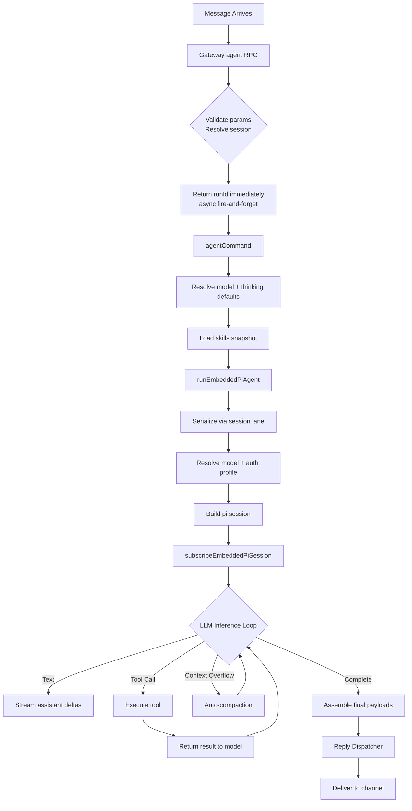
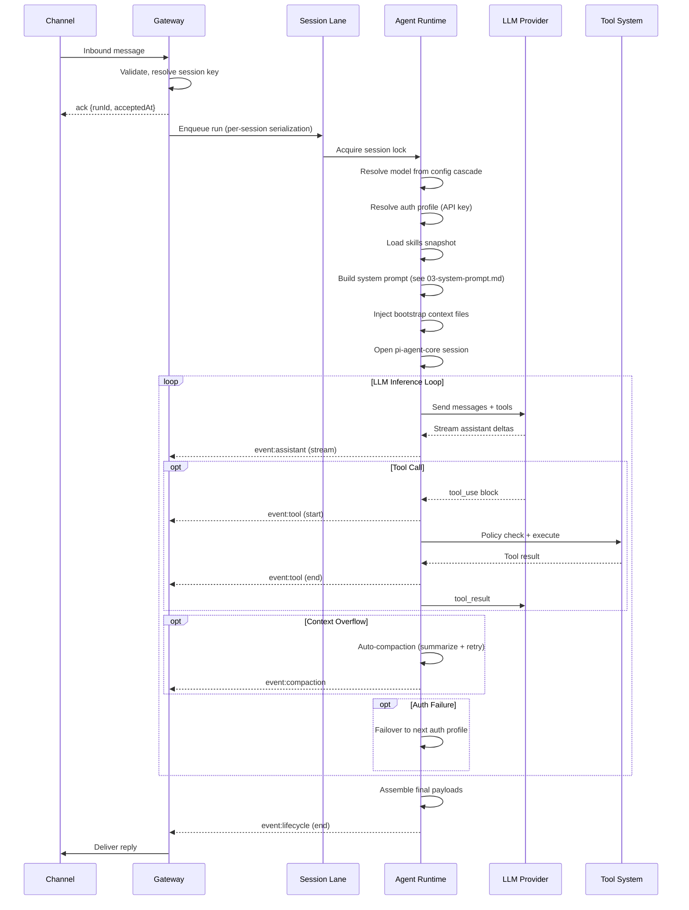
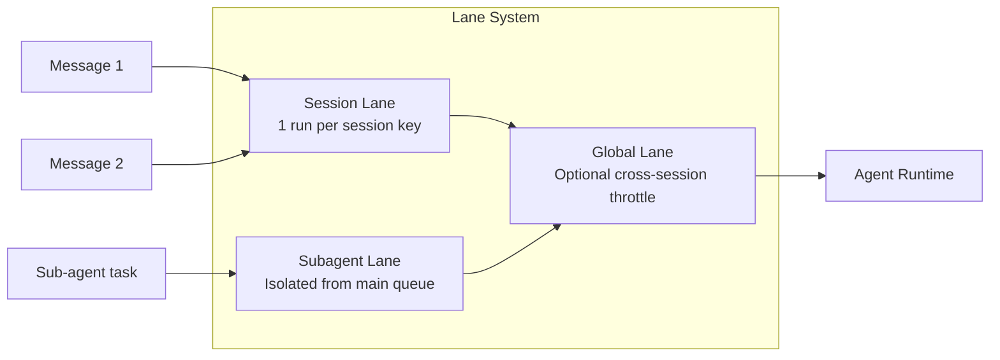

# Agent Loop Lifecycle

## Overview

The agent loop is the core execution path: intake, context assembly, model inference, tool execution, streaming replies, and persistence. Each loop is a single serialized run per session that emits lifecycle and stream events.

**Source:** `src/agents/pi-embedded-runner/run.ts`, `docs/concepts/agent-loop.md`

## Entry Points

| Entry | Description |
|-------|-------------|
| **Gateway RPC** | `agent` method via WebSocket from any channel, CLI, or automation |
| **CLI** | `openclaw agent --message` command |

## High-Level Flow

## Detailed Step-by-Step

## Run Lifecycle Events

| Phase | Stream | Description |
|-------|--------|-------------|
| Accepted | lifecycle | Run ID assigned, queued for execution |
| Start | lifecycle | Session lock acquired, model resolved, system prompt built |
| Inference | assistant | LLM generates text/reasoning tokens streamed as deltas |
| Tool Call | tool | Model requests a tool; tool executes and returns result |
| Compaction | compaction | Context overflow triggers summarize-and-retry |
| End | lifecycle | Run completes; payloads assembled |
| Error | lifecycle | Run errors; error text assembled |

## Queueing and Concurrency

- **Session Lane:** One run at a time per session key. Prevents tool/session transcript races.
- **Global Lane:** Optional cross-session throttle for resource management.
- **Subagent Lane:** Sub-agents use `CommandLane.Subagent`, isolated from main session queue.

**Source:** `src/agents/lanes.ts`, `src/process/lanes.ts`, `src/process/command-queue.ts`

## Reply Shaping and Suppression

Final payloads are assembled from:
- Assistant text (and optional reasoning)
- Inline tool summaries (when verbose + allowed)
- Assistant error text when the model errors

Special handling:
- `NO_REPLY` token is filtered from outgoing payloads (silent token)
- Messaging tool duplicates are removed from the final payload list
- If no renderable payloads remain and a tool errored, a fallback error reply is emitted

**Source:** `src/agents/pi-embedded-subscribe.handlers.messages.ts`

## Timeouts

| Timeout | Default | Description |
|---------|---------|-------------|
| Agent run | 600s | `agents.defaults.timeoutSeconds`; enforced via abort timer |
| `agent.wait` | 30s | Wait-only; does not stop the agent run |
| Sub-agent | 0 (none) | Sub-agents are long-lived by default |

**Source:** `src/agents/timeout.ts`, `src/agents/pi-embedded-runner/run.ts`
