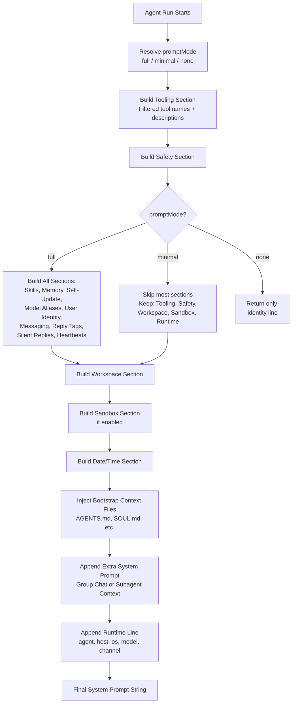
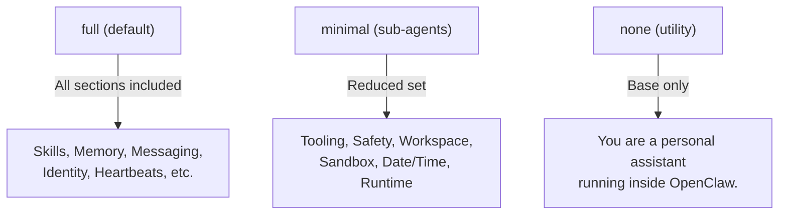

# System Prompt Architecture

## Overview

OpenClaw builds a **custom system prompt** for every agent run. It does NOT use the default pi-coding-agent prompt. The prompt is assembled by `buildAgentSystemPrompt()` and injected into each run.

**Source:** `src/agents/system-prompt.ts`, `docs/concepts/system-prompt.md`

## Prompt Assembly Flow



## Prompt Sections

| Section | Content | Included In |
|---------|---------|-------------|
| **Identity** | "You are a personal assistant running inside OpenClaw." | all modes |
| **Tooling** | Filtered tool list with case-sensitive names and short descriptions | all modes |
| **Tool Call Style** | "Default: do not narrate routine tool calls. Narrate only when it helps." | all modes |
| **Safety** | No power-seeking, no self-preservation, pause-and-ask on conflicts | all modes |
| **CLI Quick Reference** | OpenClaw CLI subcommand reference | full only |
| **Skills** | Available skill names/descriptions + "read SKILL.md with `read` tool" | full only |
| **Memory Recall** | "Before answering: run memory_search on MEMORY.md + memory/*.md" | full only |
| **Self-Update** | Gateway config.apply and update.run rules (only when asked) | full only |
| **Model Aliases** | Alias-to-model mappings for overrides | full only |
| **Workspace** | Working directory path + guidance | all modes |
| **Documentation** | Local docs path + web mirror URLs | full only |
| **Sandbox** | Container paths, elevated exec, browser bridge info | when sandboxed |
| **User Identity** | Owner phone numbers for trust verification | full only |
| **Date & Time** | User timezone | all modes |
| **Workspace Files** | Header for bootstrap context injection | all modes |
| **Reply Tags** | Native reply/quote syntax `[[reply_to_current]]` | full only |
| **Messaging** | Channel routing, message tool, inline buttons | full only |
| **Voice (TTS)** | Text-to-speech hint | full only |
| **Reactions** | Emoji reaction guidance (minimal/extensive) | when enabled |
| **Reasoning** | `<think>...</think><final>...</final>` tag format | when reasoning tags enabled |
| **Project Context** | Injected bootstrap files + SOUL.md persona | all modes |
| **Silent Replies** | NO_REPLY token usage rules | full only |
| **Heartbeats** | Heartbeat prompt + HEARTBEAT_OK ack protocol | full only |
| **Runtime** | agent=ID, host, os, model, channel, thinking level | all modes |

## Prompt Modes



- **full:** Default for main agent sessions. All sections included.
- **minimal:** Used for sub-agents. Extra system prompt labeled "Subagent Context" instead of "Group Chat Context".
- **none:** Returns only the base identity line.

**Source:** `src/agents/system-prompt.ts` (type `PromptMode`)

## Bootstrap Context Files

These user-editable files are injected into the Project Context section:

| File | Purpose | Injected for Sub-agents? |
|------|---------|--------------------------|
| `AGENTS.md` | Repository/project guidelines | Yes |
| `SOUL.md` | Persona (tone, mannerisms, mood) | No |
| `TOOLS.md` | User guidance for external tools | Yes |
| `IDENTITY.md` | Agent identity configuration | No |
| `USER.md` | User profile and preferences | No |
| `HEARTBEAT.md` | Heartbeat behavior | No |
| `MEMORY.md` / `memory.md` | Persistent notes | No |
| `BOOTSTRAP.md` | Brand-new workspace only | No |

**Size limits:**
- Per-file max: `agents.defaults.bootstrapMaxChars` (default: 20,000)
- Total cap: `agents.defaults.bootstrapTotalMaxChars` (default: 24,000)
- Large files are truncated with a marker

**Source:** `src/agents/bootstrap-files.ts`, `src/agents/pi-embedded-helpers.ts`

## Core Tool Summaries (Built into Prompt)

The system prompt includes short summaries for each available tool:

```
- read: Read file contents
- write: Create or overwrite files
- edit: Make precise edits to files
- exec: Run shell commands (pty available for TTY-required CLIs)
- web_search: Search the web (Brave API)
- browser: Control web browser
- cron: Manage cron jobs and wake events
- sessions_spawn: Spawn a sub-agent session
- subagents: List, steer, or kill sub-agent runs
- memory_search: Search memory via vector embeddings
  ...
```

Tool names are case-sensitive and called exactly as listed.

**Source:** `src/agents/system-prompt.ts` (`coreToolSummaries` object)

## Runtime Line

A single line at the end encoding runtime metadata:

```
Runtime: agent=main | host=myhost | os=darwin (arm64) | node=22.x | model=anthropic/claude-sonnet-4-5 | channel=whatsapp | thinking=off
```

**Source:** `src/agents/system-prompt.ts` (`buildRuntimeLine()`)
