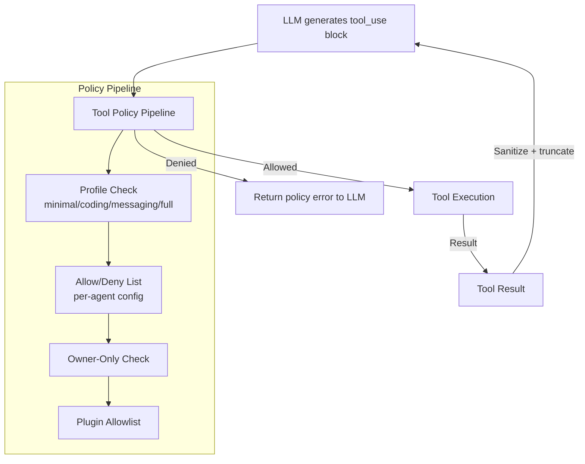
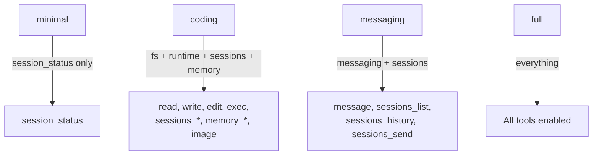
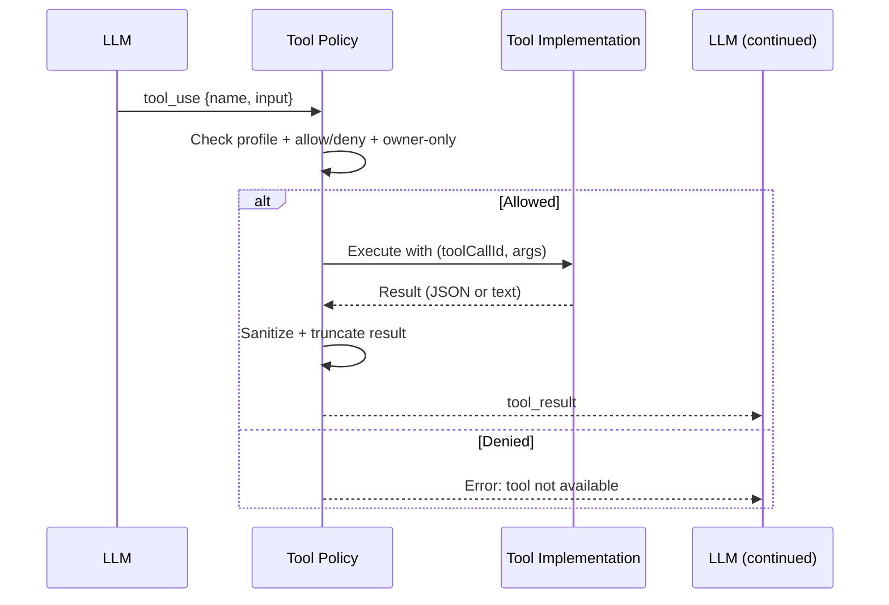

# Tool System

## Overview

OpenClaw provides 25+ built-in tools organized into functional groups, plus plugin-provided tools. Every tool call passes through a configurable policy pipeline before execution.

**Source:** `src/agents/openclaw-tools.ts`, `src/agents/tool-policy.ts`

## Tool Architecture



## Built-In Tools

### File System (group:fs)

| Tool | Description | File |
|------|-------------|------|
| `read` | Read file contents | (pi-agent-core built-in) |
| `write` | Create or overwrite files | (pi-agent-core built-in) |
| `edit` | Make precise edits to files | (pi-agent-core built-in) |
| `apply_patch` | Apply multi-file patches | `src/agents/apply-patch.ts` |
| `grep` | Search file contents for patterns | (pi-agent-core built-in) |
| `find` | Find files by glob pattern | (pi-agent-core built-in) |
| `ls` | List directory contents | (pi-agent-core built-in) |

### Runtime (group:runtime)

| Tool | Description | File |
|------|-------------|------|
| `exec` | Run shell commands (PTY available) | `src/agents/bash-tools.exec.ts` |
| `process` | Manage background exec sessions | `src/agents/bash-tools.process.ts` |

### Web (group:web)

| Tool | Description | File |
|------|-------------|------|
| `web_search` | Search the web (Brave API) | `src/agents/tools/web-search.ts` |
| `web_fetch` | Fetch and extract readable content from URL | `src/agents/tools/web-fetch.ts` |

### UI (group:ui)

| Tool | Description | File |
|------|-------------|------|
| `browser` | Control web browser (Playwright/CDP) | `src/agents/tools/browser-tool.ts` |
| `canvas` | Present/evaluate/snapshot the Canvas | `src/agents/tools/canvas-tool.ts` |

### Session Management (group:sessions)

| Tool | Description | File |
|------|-------------|------|
| `agents_list` | List agent IDs allowed for spawn | `src/agents/tools/agents-list-tool.ts` |
| `sessions_list` | List other sessions (incl. sub-agents) | `src/agents/tools/sessions-list-tool.ts` |
| `sessions_history` | Fetch history for another session | `src/agents/tools/sessions-history-tool.ts` |
| `sessions_send` | Send a message to another session | `src/agents/tools/sessions-send-tool.ts` |
| `sessions_spawn` | Spawn a sub-agent session | `src/agents/tools/sessions-spawn-tool.ts` |
| `subagents` | List, steer, or kill sub-agent runs | `src/agents/tools/subagents-tool.ts` |
| `session_status` | Show usage/time/model state | `src/agents/tools/session-status-tool.ts` |

### Automation (group:automation)

| Tool | Description | File |
|------|-------------|------|
| `cron` | Manage cron jobs and wake events | `src/agents/tools/cron-tool.ts` |
| `gateway` | Restart, apply config, or run updates | `src/agents/tools/gateway-tool.ts` |

### Other

| Tool | Description | File |
|------|-------------|------|
| `message` | Send messages and channel actions | `src/agents/tools/message-tool.ts` |
| `nodes` | List/describe/notify/camera/screen | `src/agents/tools/nodes-tool.ts` |
| `memory_search` | Search memory via vector embeddings | `src/agents/tools/memory-tool.ts` |
| `memory_get` | Get specific memory lines | `src/agents/tools/memory-tool.ts` |
| `image` | Analyze image with configured model | `src/agents/tools/image-tool.ts` |
| `tts` | Text-to-speech synthesis | `src/agents/tools/tts-tool.ts` |

## Tool Policy System

### Tool Profiles

Four predefined profiles control which tools are available:



**Source:** `src/agents/tool-policy.ts` (`TOOL_PROFILES`)

### Tool Groups

Shorthand references that expand to member tools:

| Group | Members |
|-------|---------|
| `group:fs` | read, write, edit, apply_patch |
| `group:runtime` | exec, process |
| `group:web` | web_search, web_fetch |
| `group:sessions` | sessions_list, sessions_history, sessions_send, sessions_spawn, subagents, session_status |
| `group:ui` | browser, canvas |
| `group:automation` | cron, gateway |
| `group:messaging` | message |
| `group:nodes` | nodes |
| `group:memory` | memory_search, memory_get |
| `group:openclaw` | All OpenClaw native tools (excludes provider plugins) |

**Source:** `src/agents/tool-policy.ts` (`TOOL_GROUPS`)

### Per-Agent Tool Configuration

```json
{
  "agents": {
    "list": [{
      "id": "family",
      "tools": {
        "allow": ["read", "sessions_list", "session_status"],
        "deny": ["exec", "write", "edit", "browser", "canvas"]
      }
    }]
  }
}
```

### Tool Name Aliases

| Alias | Canonical Name |
|-------|---------------|
| `bash` | `exec` |
| `apply-patch` | `apply_patch` |

**Source:** `src/agents/tool-policy.ts` (`TOOL_NAME_ALIASES`)

## Tool Execution Flow



## Tests

| Test File | What It Tests |
|-----------|---------------|
| `src/agents/tool-policy.e2e.test.ts` | Tool policy enforcement |
| `src/agents/tool-policy.conformance.e2e.test.ts` | Tool policy conformance |
| `src/agents/tool-policy-pipeline.test.ts` | Policy pipeline logic |
| `src/agents/tool-mutation.test.ts` | Tool mutation safety |
| `src/agents/tools/browser-tool.e2e.test.ts` | Browser tool |
| `src/agents/tools/cron-tool.e2e.test.ts` | Cron tool |
| `src/agents/tools/message-tool.e2e.test.ts` | Message tool |
| `src/agents/tools/web-search.e2e.test.ts` | Web search |
| `src/agents/tools/image-tool.e2e.test.ts` | Image tool |
