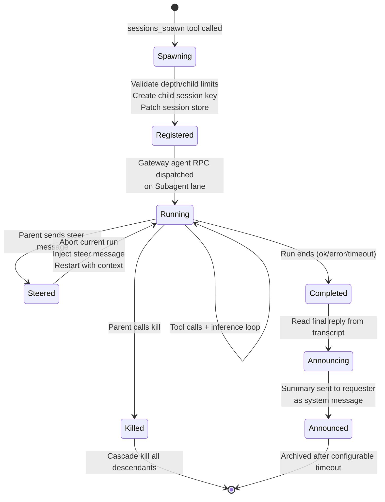
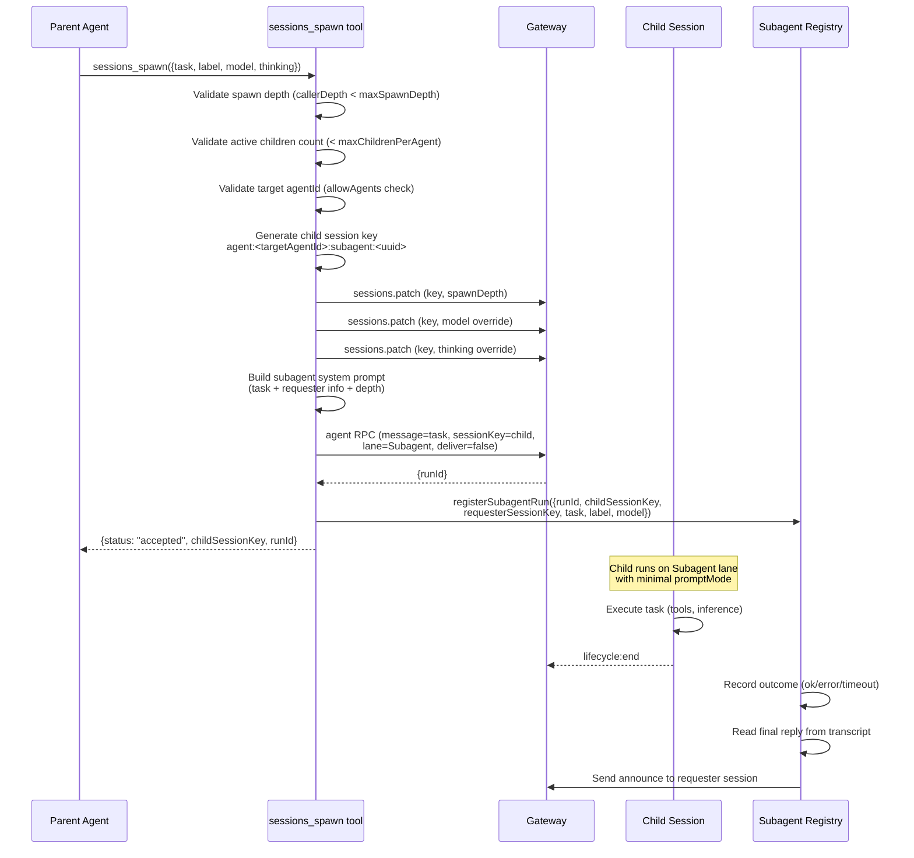
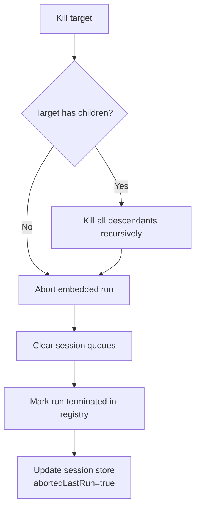
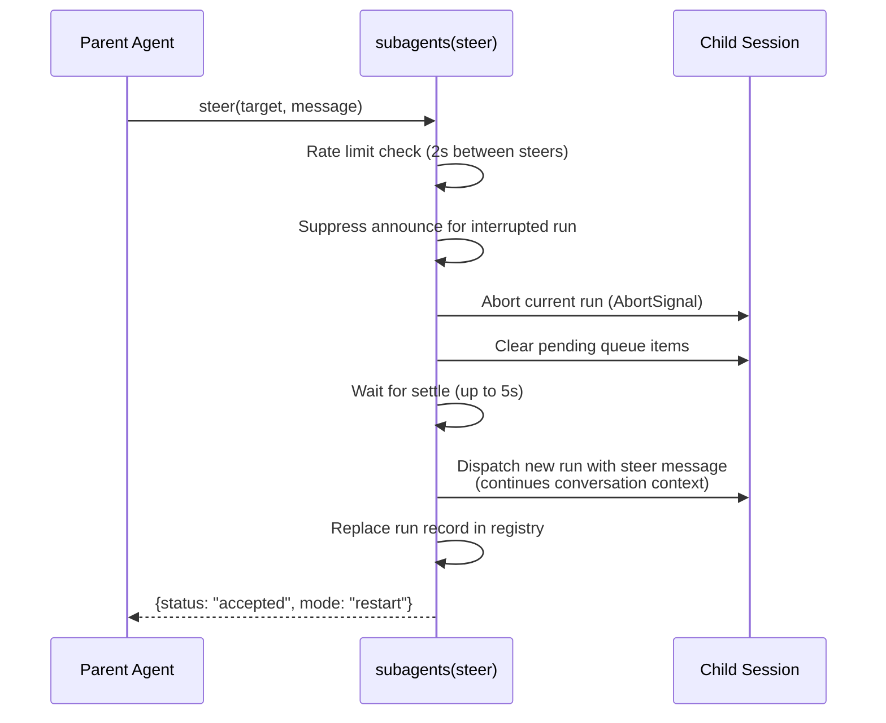

# Sub-Agent System

## Overview

OpenClaw implements a hierarchical sub-agent orchestration system. A main agent can spawn background sub-agents in isolated sessions, each with their own session key, model, thinking level, and timeout. Sub-agents run asynchronously and announce results back to the requester when complete.

**Source:** `src/agents/tools/sessions-spawn-tool.ts`, `src/agents/tools/subagents-tool.ts`, `src/agents/subagent-registry.ts`

## Sub-Agent Lifecycle



## Spawn Flow



## spawn Parameters

| Parameter | Type | Description |
|-----------|------|-------------|
| `task` | string (required) | Natural-language task description |
| `label` | string (optional) | Human-readable name for identification |
| `agentId` | string (optional) | Target different agent (subject to allowlist) |
| `model` | string (optional) | Override model (resolved from config cascade) |
| `thinking` | string (optional) | Override thinking/reasoning level |
| `runTimeoutSeconds` | number (optional) | Per-run timeout (default: 0 = no timeout) |
| `cleanup` | "delete" \| "keep" | Auto-cleanup session after completion |

**Source:** `src/agents/tools/sessions-spawn-tool.ts` (`SessionsSpawnToolSchema`)

## Depth and Concurrency Limits

| Limit | Config Path | Default |
|-------|-------------|---------|
| Max spawn depth | `agents.defaults.subagents.maxSpawnDepth` | 1 |
| Max children per agent | `agents.defaults.subagents.maxChildrenPerAgent` | 5 |
| Allowed cross-agent IDs | `agents.list[].subagents.allowAgents` | [] (same agent only) |
| Archive timeout | `agents.defaults.subagents.archiveAfterMinutes` | 60 minutes |

**Source:** `src/agents/tools/sessions-spawn-tool.ts`, `src/agents/subagent-depth.ts`

## Subagents Tool (List / Kill / Steer)

The `subagents` tool provides three actions:

### List

Shows active and recently completed sub-agents with status, model, runtime, and token usage.

```
active subagents:
1. research-task (claude-sonnet-4-5, 2m30s, 12.5k tokens) running - Research the market trends
2. code-review (claude-sonnet-4-5, 1m15s, 8.2k tokens) running - Review the PR

recent (last 30m):
3. data-analysis (claude-sonnet-4-5, 5m20s, 45.3k tokens) done - Analyze the dataset
```

### Kill

Terminates a sub-agent (by index, label, or session key). **Cascading:** recursively kills all descendant sub-agents.



### Steer

Redirects an active sub-agent mid-execution with a new message:



**Source:** `src/agents/tools/subagents-tool.ts`

## Announce Flow

When a sub-agent completes, its result is announced back to the requester:

1. Read the sub-agent's latest assistant reply from session transcript
2. Build a compact stats line (duration, token usage)
3. Format as a system message: `[System Message] Sub-agent "{label}" completed: {summary}`
4. Send to the requester session via `sessions_send` or direct message injection
5. If the requester session has an active run, the system message is queued

**Source:** `src/agents/subagent-announce.ts`, `src/agents/subagent-announce-queue.ts`

## Sub-Agent System Prompt

Sub-agents receive:
- `promptMode: "minimal"` (reduced sections)
- A "Subagent Context" section containing the task, requester info, and depth limits
- Only `AGENTS.md` and `TOOLS.md` from bootstrap files (other files filtered)
- Their own session key and isolation

**Source:** `src/agents/subagent-announce.ts` (`buildSubagentSystemPrompt`)

## Tests

| Test File | What It Tests |
|-----------|---------------|
| `src/agents/openclaw-tools.subagents.sessions-spawn.test-harness.ts` | Spawn tool test harness |
| `src/agents/tools/sessions-announce-target.e2e.test.ts` | Announce target resolution |
| `src/agents/tools/sessions-list-tool.gating.e2e.test.ts` | Session list gating |
| `src/agents/tools/sessions-send-tool.gating.e2e.test.ts` | Session send gating |
