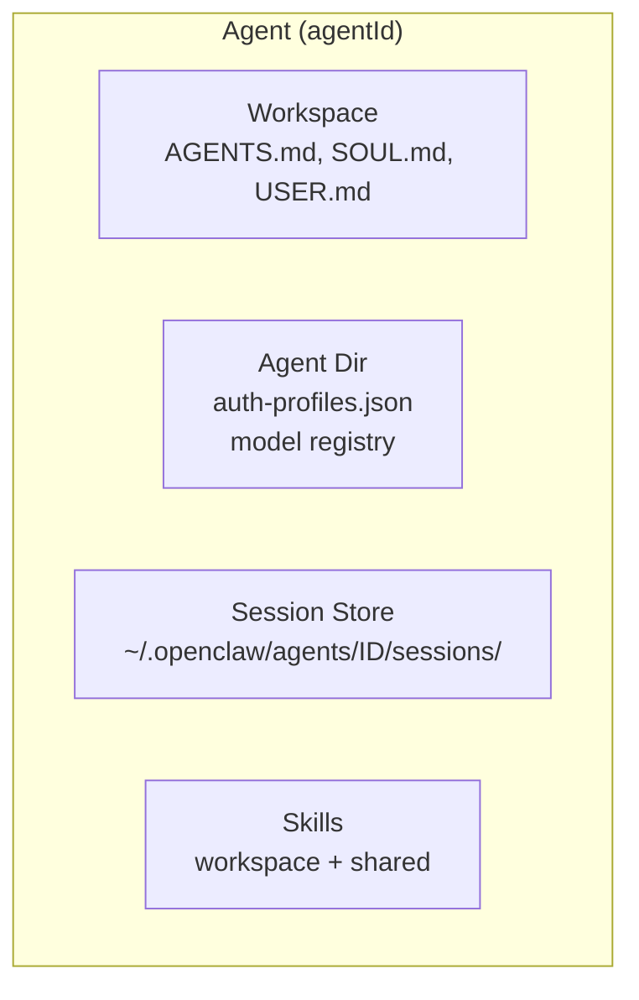
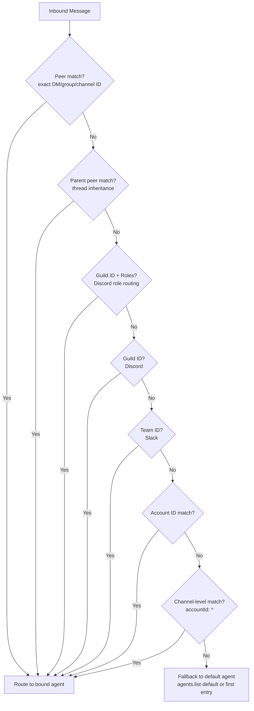

# Multi-Agent Routing

## Overview

OpenClaw supports multiple fully isolated agents in a single gateway process. Each agent has its own workspace, auth profiles, session store, and persona. Inbound messages are routed to agents via deterministic binding rules.

**Source:** `docs/concepts/multi-agent.md`, `src/agents/agent-scope.ts`

## What Is an Agent?



An **agent** is a fully scoped brain with:
- **Workspace:** Files, AGENTS.md, SOUL.md, USER.md, local notes, persona rules
- **State directory (agentDir):** Auth profiles, model registry, per-agent config under `~/.openclaw/agents/<agentId>/agent/`
- **Session store:** Chat history + routing state under `~/.openclaw/agents/<agentId>/sessions/`
- **Skills:** Per-agent via workspace `skills/` folder + shared from `~/.openclaw/skills`

Auth profiles are **per-agent** and are NOT shared automatically across agents.

## Routing Rules (Bindings)

Bindings are **deterministic** and **most-specific wins**:



## Configuration Examples

### Single Agent (Default)

No configuration needed. OpenClaw runs a single agent:
- `agentId` defaults to `main`
- Sessions keyed as `agent:main:<mainKey>`
- Workspace at `~/.openclaw/workspace`

### Two WhatsApp Numbers, Two Agents

```json
{
  "agents": {
    "list": [
      { "id": "home", "default": true, "workspace": "~/.openclaw/workspace-home" },
      { "id": "work", "workspace": "~/.openclaw/workspace-work" }
    ]
  },
  "bindings": [
    { "agentId": "home", "match": { "channel": "whatsapp", "accountId": "personal" } },
    { "agentId": "work", "match": { "channel": "whatsapp", "accountId": "biz" } }
  ]
}
```

### Channel Split (WhatsApp fast + Telegram deep)

```json
{
  "agents": {
    "list": [
      { "id": "chat", "model": "anthropic/claude-sonnet-4-5", "workspace": "~/.openclaw/workspace-chat" },
      { "id": "opus", "model": "anthropic/claude-opus-4-6", "workspace": "~/.openclaw/workspace-opus" }
    ]
  },
  "bindings": [
    { "agentId": "chat", "match": { "channel": "whatsapp" } },
    { "agentId": "opus", "match": { "channel": "telegram" } }
  ]
}
```

### Per-Agent Sandbox and Tool Restrictions

```json
{
  "agents": {
    "list": [
      {
        "id": "family",
        "workspace": "~/.openclaw/workspace-family",
        "sandbox": { "mode": "all", "scope": "agent" },
        "tools": {
          "allow": ["read", "sessions_list", "session_status"],
          "deny": ["exec", "write", "edit", "browser", "canvas"]
        }
      }
    ]
  }
}
```

## Key Paths

| Path | Purpose |
|------|---------|
| `~/.openclaw/openclaw.json` | Main configuration |
| `~/.openclaw/workspace` | Default workspace (or `~/.openclaw/workspace-<agentId>`) |
| `~/.openclaw/agents/<agentId>/agent` | Agent state dir (auth profiles, model registry) |
| `~/.openclaw/agents/<agentId>/sessions` | Session transcripts |

## Session Keys

| Pattern | Purpose |
|---------|---------|
| `agent:<agentId>:<mainKey>` | Main session for an agent |
| `agent:<agentId>:subagent:<uuid>` | Sub-agent session |

**Source:** `src/routing/session-key.ts`
