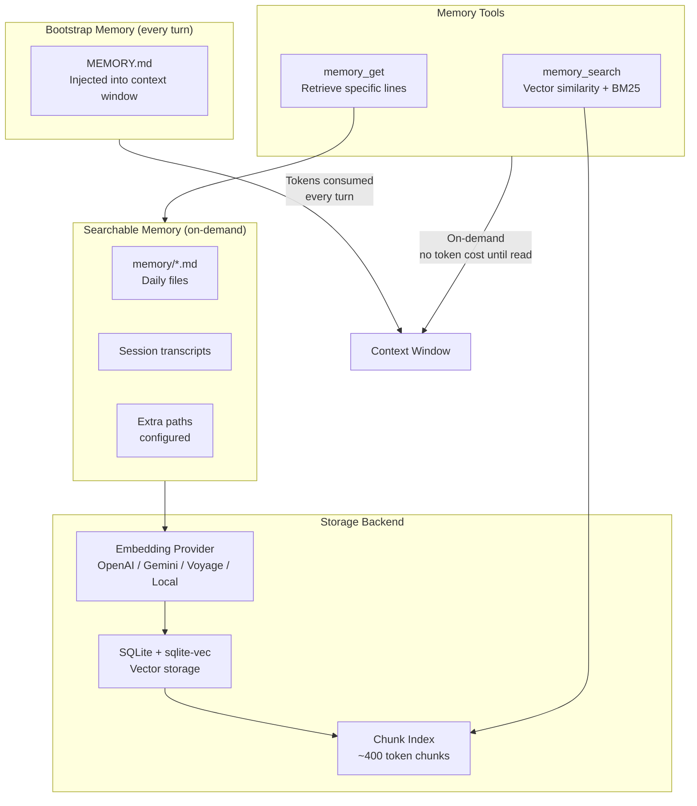
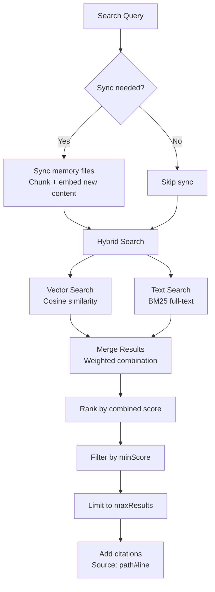

# Memory System

## Overview

OpenClaw provides a persistent, vector-indexed memory system with two tiers: bootstrap memory (injected every turn) and searchable memory (on-demand via tools). The system uses SQLite with vector extensions for storage and supports multiple embedding providers.

**Source:** `src/memory/`, `src/agents/memory-search.ts`, `src/agents/tools/memory-tool.ts`

## Architecture



## Two-Tier Memory

### Tier 1: Bootstrap Memory (MEMORY.md)

- Injected into the context window on every turn
- Consumes tokens (keep concise!)
- Subject to `bootstrapMaxChars` limits (default: 20,000 chars per file)
- Located in agent workspace root

### Tier 2: Searchable Memory (memory/*.md + sessions)

- Accessed on-demand via `memory_search` and `memory_get` tools
- Does NOT consume context tokens unless explicitly read
- Daily files in `memory/` directory
- Session transcripts (when `experimental.sessionMemory` enabled)

## Embedding Providers

| Provider | Model | Config Key |
|----------|-------|------------|
| `openai` | text-embedding-3-small | Default |
| `gemini` | gemini-embedding-001 | `memory.provider: "gemini"` |
| `voyage` | voyage-4-large | `memory.provider: "voyage"` |
| `local` | ONNX model (no API key) | `memory.provider: "local"` |
| `auto` | Auto-select from available credentials | `memory.provider: "auto"` |

Fallback provider can be configured separately via `memory.fallback`.

**Source:** `src/agents/memory-search.ts` (constants: `DEFAULT_OPENAI_MODEL`, `DEFAULT_GEMINI_MODEL`, `DEFAULT_VOYAGE_MODEL`)

## Search Pipeline



### Hybrid Search Parameters

| Parameter | Config Path | Default |
|-----------|-------------|---------|
| Vector weight | `memory.query.hybrid.vectorWeight` | 0.7 |
| Text weight | `memory.query.hybrid.textWeight` | 0.3 |
| Candidate multiplier | `memory.query.hybrid.candidateMultiplier` | 4 |
| Max results | `memory.query.maxResults` | 6 |
| Min score | `memory.query.minScore` | 0.35 |

**Source:** `src/memory/hybrid.ts`, `src/memory/search-manager.ts`

## Chunking

Documents are split into chunks for embedding:

| Parameter | Config Path | Default |
|-----------|-------------|---------|
| Chunk size | `memory.chunking.tokens` | 400 tokens |
| Overlap | `memory.chunking.overlap` | 80 tokens |

**Source:** `src/memory/embedding-chunk-limits.ts`

## Sync Pipeline

Memory files are automatically synced:

| Trigger | Config Path | Default |
|---------|-------------|---------|
| On session start | `memory.sync.onSessionStart` | true |
| On search | `memory.sync.onSearch` | true |
| File watcher | `memory.sync.watch` | true |
| Watch debounce | `memory.sync.watchDebounceMs` | 1500ms |
| Periodic interval | `memory.sync.intervalMinutes` | (configured) |
| Session delta bytes | `memory.sync.sessions.deltaBytes` | 100,000 |
| Session delta messages | `memory.sync.sessions.deltaMessages` | 50 |

**Source:** `src/memory/sync-memory-files.ts`, `src/memory/sync-session-files.ts`

## System Prompt Integration

When memory tools are available, the system prompt includes:

```
## Memory Recall
Before answering anything about prior work, decisions, dates, people, preferences,
or todos: run memory_search on MEMORY.md + memory/*.md; then use memory_get to pull
only the needed lines. If low confidence after search, say you checked.
Citations: include Source: <path#line> when it helps the user verify memory snippets.
```

**Source:** `src/agents/system-prompt.ts` (`buildMemorySection`)

## Tests

| Test File | What It Tests |
|-----------|---------------|
| `src/agents/tools/memory-tool.citations.e2e.test.ts` | Memory citation format |
| `src/agents/tools/memory-tool.does-not-crash-on-errors.e2e.test.ts` | Error resilience |
| `src/agents/memory-search.e2e.test.ts` | Config resolution |
| `src/memory/index.test.ts` | Core memory operations |
| `src/memory/hybrid.test.ts` | Hybrid search logic |
| `src/memory/embeddings.test.ts` | Embedding generation |
| `src/memory/manager.*.test.ts` | Memory manager (6+ test files) |
