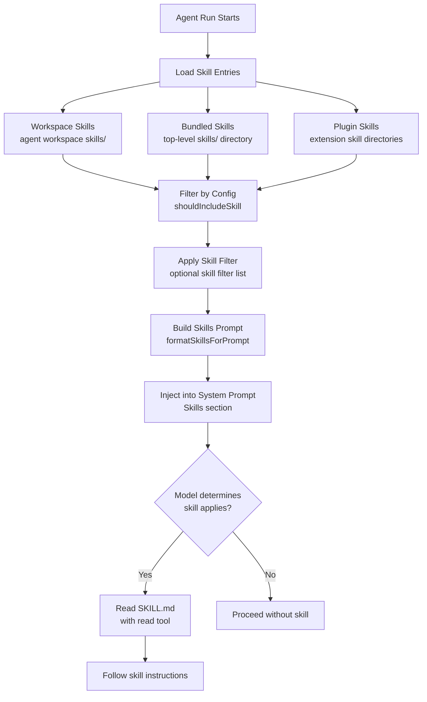

# Skills System

## Overview

Skills are loadable instruction bundles (SKILL.md files) that provide domain expertise. They are discovered at startup from multiple sources, listed in the system prompt, and loaded lazily on demand when the model determines a skill applies to the current task.

**Source:** `src/agents/skills.ts`, `src/agents/skills/workspace.ts`, `src/agents/skills/types.ts`

## Skill Discovery Flow



## Skill Sources

| Source | Location | Description |
|--------|----------|-------------|
| **Workspace** | `<workspace>/skills/` | Per-agent skills in the agent's workspace |
| **Bundled** | `skills/` (repo root) | 48 built-in skills shipped with OpenClaw |
| **Plugin** | `extensions/*/skills/` | Skills provided by extensions |
| **Shared** | `~/.openclaw/skills` | Shared skills available to all agents |

**Source:** `src/agents/skills/workspace.ts`, `src/agents/skills/bundled-dir.ts`, `src/agents/skills/plugin-skills.ts`

## System Prompt Integration

The Skills section in the system prompt:

```
## Skills (mandatory)
Before replying: scan <available_skills> <description> entries.
- If exactly one skill clearly applies: read its SKILL.md at <location> with `read`, then follow it.
- If multiple could apply: choose the most specific one, then read/follow it.
- If none clearly apply: do not read any SKILL.md.
Constraints: never read more than one skill up front; only read after selecting.

<available_skills>
  <skill name="github" description="GitHub integration" location="skills/github/" />
  <skill name="coding-agent" description="Coding assistance" location="skills/coding-agent/" />
  ...
</available_skills>
```

**Source:** `src/agents/system-prompt.ts` (`buildSkillsSection`)

## Skill Metadata (Frontmatter)

SKILL.md files can include YAML frontmatter for metadata. The format uses a `metadata.openclaw` namespace for OpenClaw-specific fields:

```yaml
---
name: my-skill
description: "What this skill does"
metadata:
  openclaw:
    emoji: "🔧"
    os: ["darwin", "linux"]
    requires:
      bins: ["git", "node"]
    install:
      - id: brew
        kind: brew
        packages: ["git"]
allowed-tools: ["message"]
user-invocable: true
disable-model-invocation: false
---
```

| Field | Purpose |
|-------|---------|
| `name` | Skill identifier |
| `description` | Shown in system prompt skill list |
| `metadata.openclaw.os` | OS restrictions (darwin, linux, win32) |
| `metadata.openclaw.requires.bins` | Binary dependencies that must exist |
| `metadata.openclaw.requires.anyBins` | At least one of these binaries must exist |
| `metadata.openclaw.install` | Installation specs for dependencies |
| `metadata.openclaw.emoji` | Display emoji for the skill |
| `allowed-tools` | Tools the skill is permitted to use |
| `user-invocable` | Boolean (default: true) — user can invoke manually |
| `disable-model-invocation` | Boolean (default: false) — prevent model from auto-selecting |

**Source:** `src/agents/skills/frontmatter.ts`, `src/agents/skills/types.ts`

## Bundled Skills Catalog

| Skill | Directory | Description |
|-------|-----------|-------------|
| 1password | `skills/1password/` | 1Password vault access |
| apple-notes | `skills/apple-notes/` | Apple Notes integration |
| apple-reminders | `skills/apple-reminders/` | Apple Reminders integration |
| bear-notes | `skills/bear-notes/` | Bear notes app |
| blogwatcher | `skills/blogwatcher/` | Blog monitoring |
| camsnap | `skills/camsnap/` | Camera snapshots |
| canvas | `skills/canvas/` | Canvas operations |
| clawhub | `skills/clawhub/` | ClawHub skill marketplace |
| coding-agent | `skills/coding-agent/` | Coding assistance |
| discord | `skills/discord/` | Discord operations |
| github | `skills/github/` | GitHub integration |
| goplaces | `skills/goplaces/` | Location services |
| healthcheck | `skills/healthcheck/` | System health checks |
| notion | `skills/notion/` | Notion workspace |
| obsidian | `skills/obsidian/` | Obsidian vault management |
| peekaboo | `skills/peekaboo/` | Camera/screen capture |
| skill-creator | `skills/skill-creator/` | Create and test new skills |
| slack | `skills/slack/` | Slack workspace operations |
| spotify-player | `skills/spotify-player/` | Spotify playback |
| summarize | `skills/summarize/` | Content summarization |
| things-mac | `skills/things-mac/` | Things app (macOS) |
| trello | `skills/trello/` | Trello boards |
| voice-call | `skills/voice-call/` | Voice call handling |
| weather | `skills/weather/` | Weather information |

*(48 bundled skills total — additional skills in extensions and .agents/skills/)*

## Extension Skills

| Skill | Extension | Location |
|-------|-----------|----------|
| prose | open-prose | `extensions/open-prose/skills/prose/` |
| feishu-doc | feishu | `extensions/feishu/skills/feishu-doc/` |
| feishu-wiki | feishu | `extensions/feishu/skills/feishu-wiki/` |
| feishu-drive | feishu | `extensions/feishu/skills/feishu-drive/` |
| feishu-perm | feishu | `extensions/feishu/skills/feishu-perm/` |
| lobster | lobster | `extensions/lobster/SKILL.md` |

## Repo-Level Skills (.agents/skills/)

The OpenClaw repo itself has repo-level skills for maintainers:

| Skill | Location | Purpose |
|-------|----------|---------|
| review-pr | `.agents/skills/review-pr/SKILL.md` | PR review workflow |
| prepare-pr | `.agents/skills/prepare-pr/SKILL.md` | PR preparation workflow |
| merge-pr | `.agents/skills/merge-pr/SKILL.md` | PR merge workflow |
| mintlify | `.agents/skills/mintlify/SKILL.md` | Documentation updates |

## Tests

| Test File | What It Tests |
|-----------|---------------|
| `src/agents/skills.e2e.test.ts` | Skills loading and filtering |
| `src/agents/skills.resolveskillspromptforrun.e2e.test.ts` | Skills prompt resolution |
| `src/agents/skills.loadworkspaceskillentries.e2e.test.ts` | Workspace skill loading |
| `src/agents/skills.buildworkspaceskillstatus.e2e.test.ts` | Skill status building |
| `src/agents/skills.build-workspace-skills-prompt.*.e2e.test.ts` | Prompt building (3 tests) |
| `src/agents/skills.summarize-skill-description.e2e.test.ts` | Description summarization |
| `src/agents/skills/frontmatter.e2e.test.ts` | Frontmatter parsing |
| `src/agents/skills/bundled-dir.e2e.test.ts` | Bundled directory resolution |
| `src/agents/skills/refresh.test.ts` | Skill refresh logic |
