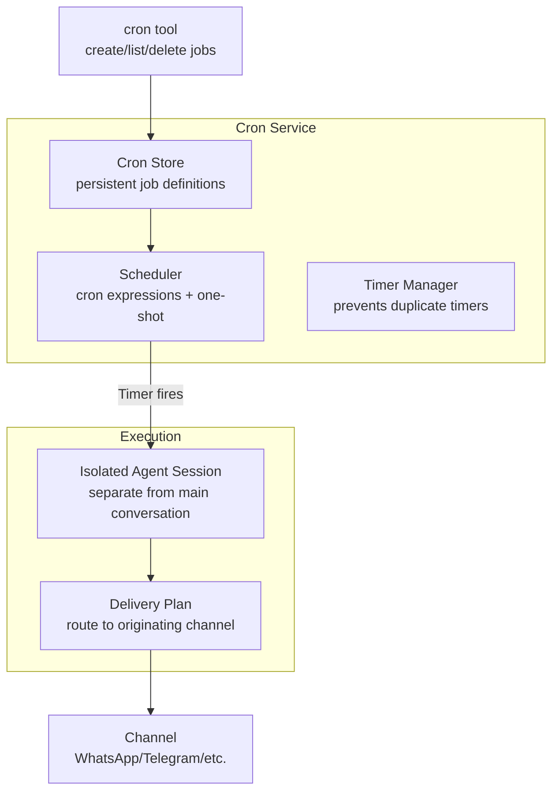
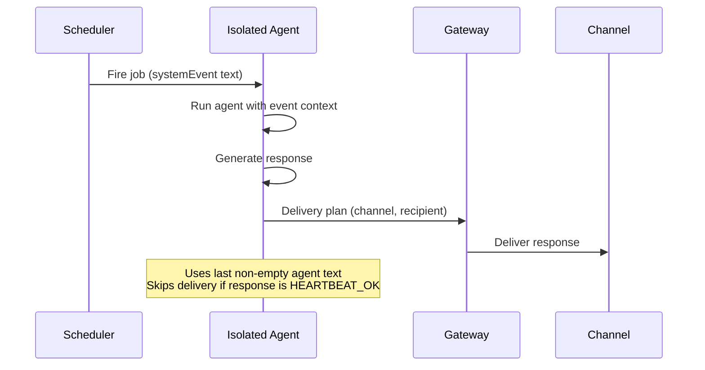
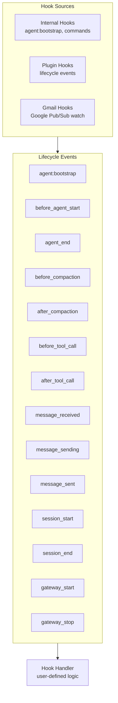
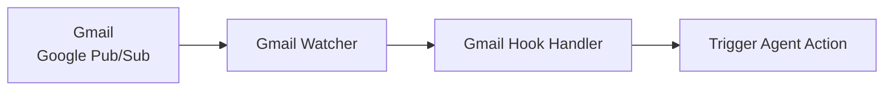
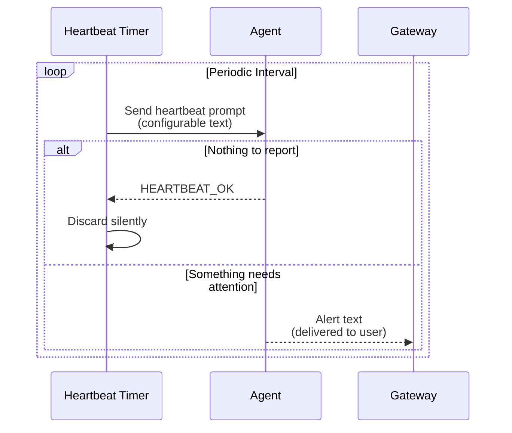

# Automation: Cron, Hooks, and Heartbeats

## Overview

OpenClaw provides three automation mechanisms: cron-based scheduling, event-driven hooks, and periodic heartbeat polling. These enable reminders, recurring tasks, email monitoring, and lifecycle event handling.

**Source:** `src/cron/`, `src/hooks/`, `src/auto-reply/heartbeat.ts`

## Cron System

### Architecture



### Cron Tool

The `cron` tool supports creating both recurring jobs and one-shot reminders:

| Action | Description |
|--------|-------------|
| `create` | Create a cron job with schedule expression or one-shot timestamp |
| `list` | List all active cron jobs |
| `delete` | Remove a cron job |
| `update` | Modify an existing job |

**System prompt guidance:** "Use for reminders; when scheduling a reminder, write the systemEvent text as something that will read like a reminder when it fires."

**Source:** `src/agents/tools/cron-tool.ts`, `src/cron/service.ts`

### Isolated Agent Execution

Cron jobs execute in an **isolated agent session** to avoid polluting the main conversation:



**Source:** `src/cron/isolated-agent.ts`

### Tests

| Test File | What It Tests |
|-----------|---------------|
| `src/cron/service.ts` (12+ test files) | Comprehensive service tests |
| `src/cron/service.delivery-plan.test.ts` | Delivery routing |
| `src/cron/service.every-jobs-fire.test.ts` | Recurring job execution |
| `src/cron/service.prevents-duplicate-timers.test.ts` | Timer deduplication |
| `src/cron/service.restart-catchup.test.ts` | Catchup after restart |
| `src/cron/service.runs-one-shot-main-job-disables-it.test.ts` | One-shot auto-disable |
| `src/cron/schedule.test.ts` | Schedule parsing |
| `src/cron/normalize.test.ts` | Job normalization |
| `src/cron/delivery.test.ts` | Delivery logic |
| `src/agents/tools/cron-tool.e2e.test.ts` | Cron tool integration |

---

## Hooks System

### Architecture



### Internal Hooks (Gateway Hooks)

Event-driven scripts for commands and lifecycle events:

| Hook | Trigger | Use Case |
|------|---------|----------|
| `agent:bootstrap` | Building bootstrap files before system prompt | Add/remove bootstrap context files |
| Command hooks | `/new`, `/reset`, `/stop` | Custom command behavior |

**Source:** `src/hooks/internal-hooks.ts`

### Plugin Hooks

Extension points inside the agent/tool lifecycle:

| Hook | Phase | Use Case |
|------|-------|----------|
| `before_agent_start` | Before run starts | Inject context or override system prompt |
| `agent_end` | After completion | Inspect final message list and metadata |
| `before_compaction` | Before compaction | Observe or annotate |
| `after_compaction` | After compaction | Post-compaction actions |
| `before_tool_call` | Before tool execution | Intercept tool params |
| `after_tool_call` | After tool execution | Intercept tool results |
| `tool_result_persist` | Before transcript write | Transform tool results |
| `message_received` | Inbound message | Pre-processing |
| `message_sending` | Before delivery | Modify outbound message |
| `message_sent` | After delivery | Post-delivery actions |
| `session_start` | Session opens | Session initialization |
| `session_end` | Session closes | Cleanup |
| `gateway_start` | Gateway boots | Startup tasks |
| `gateway_stop` | Gateway shuts down | Shutdown tasks |

**Source:** `src/hooks/hooks.ts`, `src/hooks/loader.ts`

### Gmail Hooks

Watch for incoming emails via Google Pub/Sub:



**Source:** `src/hooks/gmail.ts`, `src/hooks/gmail-watcher.ts`, `src/hooks/gmail-ops.ts`

### Tests

| Test File | What It Tests |
|-----------|---------------|
| `src/hooks/internal-hooks.test.ts` | Internal hook execution |
| `src/hooks/loader.test.ts` | Hook loading |
| `src/hooks/workspace.test.ts` | Workspace hook resolution |
| `src/hooks/install.test.ts` | Hook installation |
| `src/hooks/frontmatter.test.ts` | Hook frontmatter parsing |
| `src/hooks/gmail.test.ts` | Gmail integration |
| `src/hooks/gmail-setup-utils.test.ts` | Gmail setup utilities |
| `src/hooks/gmail-watcher.test.ts` | Gmail watcher |
| `src/hooks/hooks-install.e2e.test.ts` | Hook install E2E |

---

## Heartbeat System

### How It Works



### System Prompt Integration

```
## Heartbeats
Heartbeat prompt: (configured)
If you receive a heartbeat poll matching the heartbeat prompt above,
and there is nothing that needs attention, reply exactly:
HEARTBEAT_OK
OpenClaw treats a leading/trailing "HEARTBEAT_OK" as a heartbeat ack
(and may discard it).
If something needs attention, do NOT include "HEARTBEAT_OK";
reply with the alert text instead.
```

**Source:** `src/auto-reply/heartbeat.ts`, `src/agents/system-prompt.ts`

### Tests

| Test File | What It Tests |
|-----------|---------------|
| `src/auto-reply/heartbeat.test.ts` | Heartbeat prompt detection and ack |
