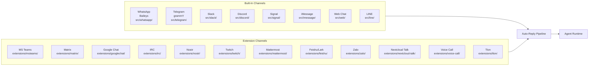
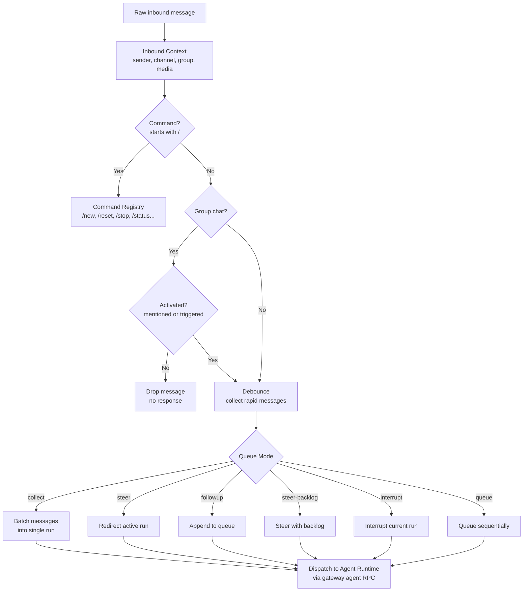

# Channels and Messaging

## Overview

OpenClaw connects to 18+ messaging channels through built-in adapters and extensions. All channels converge into the same auto-reply pipeline and agent runtime.

**Source:** `src/auto-reply/`, `src/channels/`, `src/routing/`

## Channel Map

## Auto-Reply Pipeline

### Pipeline Stages

| Stage | File | Description |
|-------|------|-------------|
| Inbound context | `src/auto-reply/envelope.ts` | Contextualize raw message with sender, channel, media |
| Command detection | `src/auto-reply/command-detection.ts` | Detect `/` commands |
| Command registry | `src/auto-reply/commands-registry.ts` | Map commands to handlers |
| Group activation | `src/auto-reply/group-activation.ts` | Check mention patterns in group chats |
| Debouncing | `src/auto-reply/inbound-debounce.ts` | Collect rapid-fire messages |
| Queue mode | `src/auto-reply/reply/queue.ts` | Collect/steer/followup modes |
| Dispatch | `src/auto-reply/dispatch.ts` | Send to agent runtime |
| Reply dispatcher | `src/auto-reply/reply/reply-dispatcher.ts` | Deliver reply back to channel |

## Message Tool

The `message` tool allows the agent to send messages proactively:

| Action | Description |
|--------|-------------|
| `send` | Send a message to a channel (with optional `to`, `channel`, `buttons`) |
| `react` | React to a message with an emoji |
| `edit` | Edit a previously sent message |
| `unsend` | Delete a previously sent message |

When the agent uses `message(action=send)` to deliver its reply, it responds with `NO_REPLY` to prevent duplicate delivery.

**Source:** `src/agents/tools/message-tool.ts`

## Channel-Specific Features

| Channel | Special Features |
|---------|-----------------|
| WhatsApp | Multi-account, inline buttons, polls, reactions, media |
| Telegram | Inline buttons, polls, reactions, topic/forum support, bot commands |
| Slack | Thread support, auto-threading, channel actions, app mentions |
| Discord | Guild/role routing, slash commands, reactions, presence |
| Signal | Secure messaging, group support |
| iMessage | macOS integration, BlueBubbles bridge |
| Web Chat | Built-in web UI served by gateway |
| LINE | LINE Messaging API |

## Channel Actions (Per-Channel)

| Tool | WhatsApp | Telegram | Slack | Discord |
|------|----------|----------|-------|---------|
| `send` | Yes | Yes | Yes | Yes |
| `react` | Yes | Yes | Yes | Yes |
| `edit` | No | Yes | Yes | Yes |
| `unsend` | Yes | Yes | Yes | Yes |
| `poll` | Yes | Yes | No | No |
| `buttons` | No | Yes | No | No |

**Source:** `src/agents/tools/whatsapp-actions.ts`, `telegram-actions.ts`, `slack-actions.ts`, `discord-actions.ts`

## Tests

| Test File | What It Tests |
|-----------|---------------|
| `src/auto-reply/dispatch.test.ts` | Message dispatch |
| `src/auto-reply/dispatch.e2e.test.ts` | Dispatch E2E |
| `src/auto-reply/envelope.test.ts` | Envelope construction |
| `src/auto-reply/commands-registry.test.ts` | Command registry |
| `src/auto-reply/heartbeat.test.ts` | Heartbeat handling |
| `src/auto-reply/chunk.test.ts` | Message chunking |
| `src/agents/tools/message-tool.e2e.test.ts` | Message tool |
| `src/agents/tools/whatsapp-actions.e2e.test.ts` | WhatsApp actions |
| `src/agents/tools/telegram-actions.e2e.test.ts` | Telegram actions |
| `src/agents/tools/slack-actions.e2e.test.ts` | Slack actions |
| `src/agents/tools/discord-actions.e2e.test.ts` | Discord actions |
