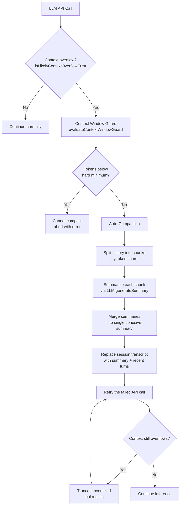
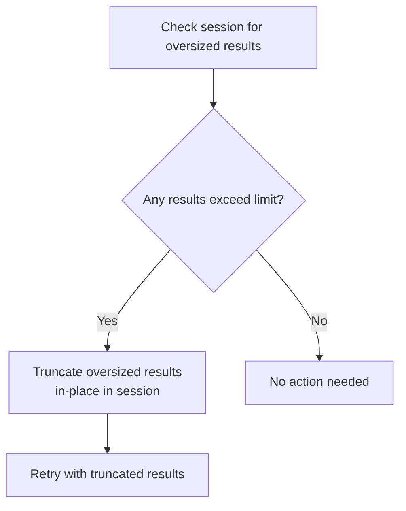
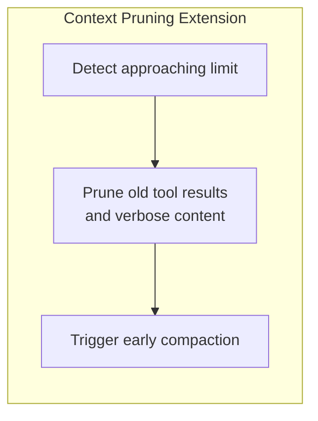
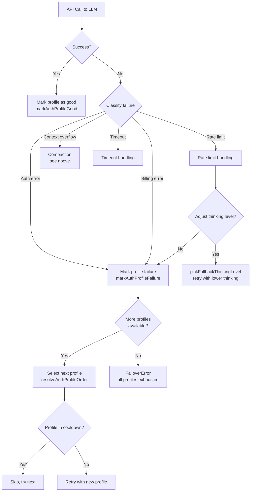

# Context Management: Compaction and Failover

## Overview

OpenClaw manages the LLM context window through auto-compaction (when context overflows) and auth profile failover (when API calls fail). Both mechanisms are transparent to the user.

**Source:** `src/agents/compaction.ts`, `src/agents/context-window-guard.ts`, `src/agents/auth-profiles.ts`

## Compaction

### When Does Compaction Trigger?

### Compaction Algorithm

| Step | Function | Description |
|------|----------|-------------|
| 1. Estimate tokens | `estimateMessagesTokens()` | Count tokens in session messages |
| 2. Strip tool details | `stripToolResultDetails()` | Remove verbose/untrusted tool result details |
| 3. Split by token share | `splitMessagesByTokenShare()` | Divide messages into ~equal token chunks |
| 4. Summarize chunks | `generateSummary()` | LLM summarizes each chunk |
| 5. Merge summaries | Merge instruction | "Preserve decisions, TODOs, open questions, constraints" |
| 6. Repair pairing | `repairToolUseResultPairing()` | Fix orphaned tool_use/tool_result pairs |
| 7. Replace transcript | Session update | Compacted summary replaces old messages |

**Source:** `src/agents/compaction.ts`

### Constants

| Constant | Value | Description |
|----------|-------|-------------|
| `BASE_CHUNK_RATIO` | 0.4 | Target chunk size as ratio of context |
| `MIN_CHUNK_RATIO` | 0.15 | Minimum chunk size |
| `SAFETY_MARGIN` | 1.2 | 20% buffer for token estimation inaccuracy |
| `DEFAULT_PARTS` | 2 | Default number of summary chunks |

### Context Window Guard

The guard evaluates whether the session can continue:

| Check | Threshold | Action |
|-------|-----------|--------|
| Hard minimum | `CONTEXT_WINDOW_HARD_MIN_TOKENS` | Abort if below |
| Warning | `CONTEXT_WINDOW_WARN_BELOW_TOKENS` | Log warning |
| Overflow | Model context limit | Trigger compaction |

**Source:** `src/agents/context-window-guard.ts`

### Tool Result Truncation

When tool results are too large, they are truncated before sending to the LLM:

**Source:** `src/agents/pi-embedded-runner/tool-result-truncation.ts`

### Context Pruning Extension

An extension that proactively prunes context before overflow:

**Source:** `src/agents/pi-extensions/context-pruning/`

---

## Auth Profile Failover

### Architecture

### Auth Profile Resolution

Multiple API keys can be configured per provider. The resolution order:

1. Explicit order from config (`agents.defaults.authProfileOrder`)
2. Last-used profile (round-robin)
3. Random selection (when no order specified)

**Source:** `src/agents/auth-profiles.ts`, `src/agents/model-auth.ts`

### Cooldown

Failed profiles enter cooldown before retry:

| Failure Type | Behavior |
|-------------|----------|
| Auth error | Profile marked failed, enters cooldown |
| Billing error | Profile marked failed with billing-specific message |
| Rate limit | Temporary cooldown |
| Timeout | May trigger failover depending on configuration |

**Source:** `src/agents/auth-profiles.ts` (`isProfileInCooldown`, `markAuthProfileFailure`)

### FailoverError

When all profiles are exhausted, a `FailoverError` is thrown with:
- The original error
- The classified failure reason
- Which profiles were tried

**Source:** `src/agents/failover-error.ts`

### Failure Classification

| Reason | Description |
|--------|-------------|
| `auth` | Authentication failure (invalid key) |
| `billing` | Billing/quota exhausted |
| `rate_limit` | Rate limit exceeded |
| `timeout` | Request timed out |
| `format` | Malformed request or unsupported format |
| `unknown` | Unclassified failure |

> **Note:** Context overflow errors are handled separately via the compaction pipeline (above) and are not classified as a failover reason.

**Source:** `src/agents/pi-embedded-helpers/errors.ts` (`classifyFailoverReason`)

## Tests

| Test File | What It Tests |
|-----------|---------------|
| `src/agents/pi-embedded-runner/run.overflow-compaction.test.ts` | Overflow compaction behavior |
| `src/agents/pi-embedded-runner/run.overflow-compaction.e2e.test.ts` | Overflow compaction E2E |
| `src/agents/context-window-guard.e2e.test.ts` | Context window guard |
| `src/agents/pi-extensions/context-pruning.e2e.test.ts` | Context pruning extension |
| `src/agents/pi-embedded-runner/tool-result-truncation.e2e.test.ts` | Tool result truncation |
| `src/agents/auth-profiles.*.e2e.test.ts` | Auth profile tests (5+ files) |
| `src/agents/auth-health.e2e.test.ts` | Auth health monitoring |
