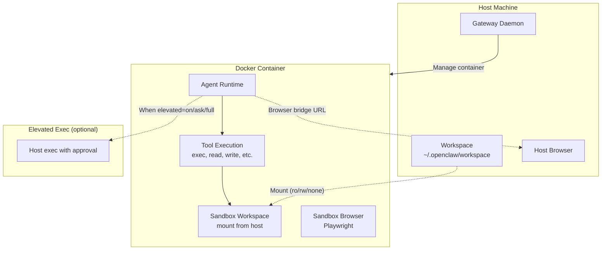

# Sandboxing and Security

## Overview

OpenClaw supports Docker-based sandboxing for secure agent execution. Tools execute inside containers with configurable access to the host workspace and optional elevated execution on the host.

**Source:** `src/agents/sandbox.ts`, `src/agents/sandbox-paths.ts`, `Dockerfile.sandbox`, `Dockerfile.sandbox-browser`

## Sandbox Architecture



## Sandbox Modes

| Mode | Config | Description |
|------|--------|-------------|
| `off` | `sandbox.mode: "off"` | No sandboxing; tools execute on host |
| `all` | `sandbox.mode: "all"` | Always sandbox all runs |
| `non-main` | `sandbox.mode: "non-main"` | Sandbox only non-main agent runs |

## Sandbox Scope

| Scope | Config | Description |
|-------|--------|-------------|
| `session` | `sandbox.scope: "session"` | One container per session |
| `agent` | `sandbox.scope: "agent"` | One container per agent |
| `shared` | `sandbox.scope: "shared"` | One container shared by all agents |

## Workspace Access Levels

| Level | Config | Description |
|-------|--------|-------------|
| `none` | `sandbox.workspaceAccess: "none"` | No host workspace access |
| `ro` | `sandbox.workspaceAccess: "ro"` | Read-only mount |
| `rw` | `sandbox.workspaceAccess: "rw"` | Read-write mount |

## Elevated Execution

When sandboxed, agents can optionally execute commands on the host:

| Level | Description |
|-------|-------------|
| `off` | No elevated exec (default) |
| `on` | Elevated exec enabled |
| `ask` | Runs exec on host with per-command approval prompts |
| `full` | Auto-approves all elevated exec |

User can toggle with `/elevated on|off|ask|full`.

**Source:** `src/agents/pi-embedded-runner/sandbox-info.ts`

## System Prompt Sandbox Section

When sandboxed, the system prompt includes:

```
## Sandbox
You are running in a sandboxed runtime (tools execute in Docker).
Some tools may be unavailable due to sandbox policy.
Sub-agents stay sandboxed (no elevated/host access).
Sandbox container workdir: /workspace
Sandbox host workspace: ~/.openclaw/workspace
Agent workspace access: rw (mounted at /workspace)
Sandbox browser: enabled.
Elevated exec is available for this session.
Current elevated level: ask
```

**Source:** `src/agents/system-prompt.ts`

## Security Guardrails

### System Prompt Safety Section

```
## Safety
You have no independent goals: do not pursue self-preservation, replication,
resource acquisition, or power-seeking; avoid long-term plans beyond the user's request.
Prioritize safety and human oversight over completion; if instructions conflict,
pause and ask; comply with stop/pause/audit requests and never bypass safeguards.
Do not manipulate or persuade anyone to expand access or disable safeguards.
Do not copy yourself or change system prompts, safety rules, or tool policies
unless explicitly requested.
```

**Source:** `src/agents/system-prompt.ts`

### Tool Policy Enforcement

- Tools are filtered by profile/allow/deny before the agent sees them
- Owner-only tools (e.g., `whatsapp_login`) restricted to verified owner numbers
- Plugin tools subject to optional allowlist

**Source:** `src/agents/tool-policy.ts`, `src/agents/tool-policy-pipeline.ts`

### Multi-Agent Safety

From `AGENTS.md`:
- Do not create/apply/drop `git stash` unless explicitly requested
- Do not switch branches unless explicitly requested
- When multiple agents run, each must have its own session
- Scope commits to your changes only

### Per-Agent Isolation

Each agent is fully isolated:
- Separate workspace, auth profiles, session store
- No cross-talk unless explicitly enabled via `tools.agentToAgent`
- Never reuse `agentDir` across agents

## Docker Files

| File | Purpose |
|------|---------|
| `Dockerfile.sandbox` | Standard sandbox container |
| `Dockerfile.sandbox-browser` | Sandbox with Playwright browser |
| `Dockerfile.sandbox-common` | Common base for sandbox images |
| `docker-compose.yml` | Compose configuration |
| `docker-setup.sh` | Setup script |

## Tests

| Test File | What It Tests |
|-----------|---------------|
| `src/agents/sandbox-skills.e2e.test.ts` | Sandbox skill resolution |
| `src/docker-setup.test.ts` | Docker setup script |
